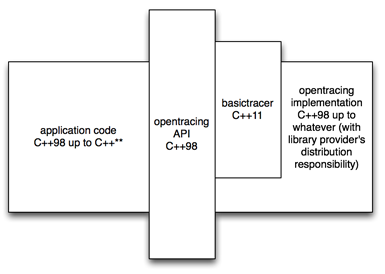

# OpenTracing API for C++
C++ implementation of the OpenTracing API http://opentracing.io

[](https://gitter.im/opentracing/opentracing-cpp?utm_source=badge&utm_medium=badge&utm_campaign=pr-badge&utm_content=badge)


## Required Reading

In order to understand the C++ platform API, one must first be familiar with the [OpenTracing project](http://opentracing.io) and
[terminology](http://opentracing.io/spec/) more generally. This is a C++98 API that is used as a "common denominator".
Ît is up to implementors to choose the C++ level they are going to use for their implementations:



## Compile and install

The default package is a header-only library. It can be installed as such

```
mkdir build
cd build
cmake ..
make install
```

If you would like to include the NoopTracer, a static library is created in addition to the headers.

```
mkdir build
cd build
cmake -Denable_noop=ON ..
make install
```

#### Tests

Testing requires the use of `gtest`. The `gtest` library is added as a submodule to this repository.
To build all of the tests, from the root repository:

```
git submodule update --recursive --remote
mkdir build
cd build
cmake -Denable_tests=ON ..
make
../bin/unittest
```

If you're using the `NoopTracer`, you would want to add `-Denable_noop=ON` as well.

## API overview for those adding instrumentation

Clients of this `OpenTracing` only need to understand the key abstractions:
    * Installing a Tracer
    * Using the Global `Tracer` to create `Spans` and `SpanContexts`
    * Adding tags, logs, or baggage to `Spans`

See the detailed [usage](./docs/usage.md) documentation for details.
